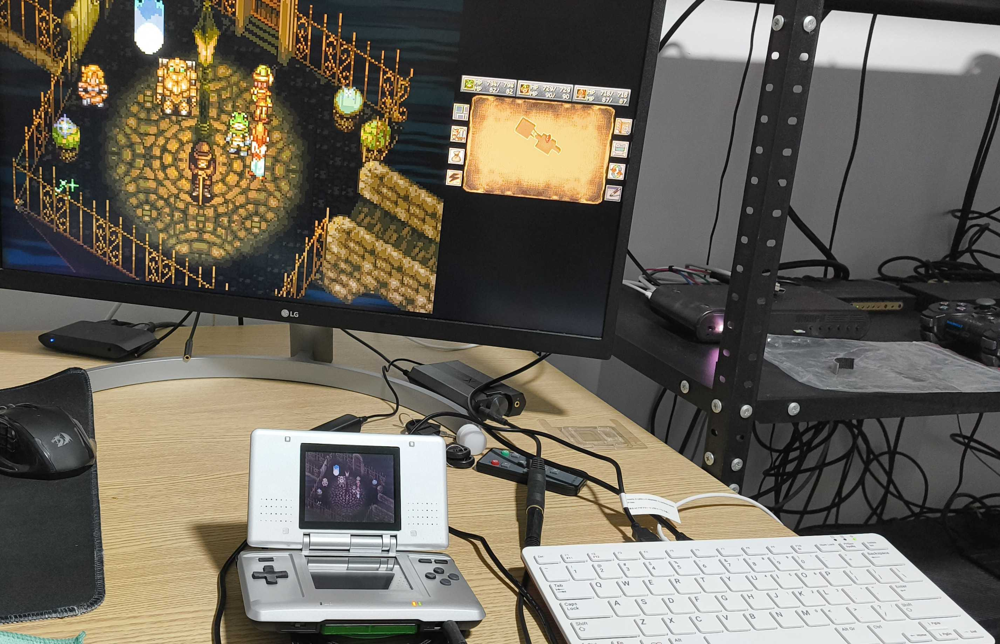

# cc3dsfs-Pi400-Kiosk Setup

This repository automates the installation and kiosk configuration of [cc3dsfs](https://github.com/Lorenzooone/cc3dsfs) on a **Raspberry Pi 400** (and compatible Raspberry Pi models such as Pi 4 and Pi 5).  
It compiles cc3dsfs from source, configures the Pi for fullscreen kiosk mode, and ensures the program automatically restarts if it ever crashes.

---

## 🧩 Recommended Operating System

You will need **Raspberry Pi OS (64-bit, Desktop version)** — this provides a graphical environment required for kiosk mode.

### 🧭 Steps to prepare your SD card:

1. **Download & install the Raspberry Pi Imager**  
   👉 [https://www.raspberrypi.com/software/](https://www.raspberrypi.com/software/)

2. **Launch Raspberry Pi Imager** and choose:
   - **Device:** Raspberry Pi 400  
   - **Operating System:**  
     → *Raspberry Pi OS (64-bit)*  
     → Choose **with desktop** (not Lite)  
   - **Storage:** Select your microSD card (≥16 GB recommended)

3. (Optional) Click the ⚙️ **settings icon** to preconfigure:
   - Hostname (e.g. `pi400-kiosk`)
   - Enable **SSH** (for remote access)
   - Set username/password
   - Configure Wi-Fi and locale

4. Click **Write**, then insert the SD card into your Pi 400.

5. **Power on your Pi** and complete the first-boot setup wizard.  
   Make sure you select:
   - Auto-login to desktop (or enable later via `raspi-config`)
   - Connect to the internet

---

## 🚀 Quick Install

Once the OS setup is complete, open **Terminal** on your Pi and run:

```bash
bash <(curl -s https://raw.githubusercontent.com/The1Azreen/cc3dsfs-pi400-kiosk/main/setup.sh)
```

## Pictures of the cc3dsfs in action



*Figure 1 — Original Nintendo Ds running cc3dsfs via the Pi400 in kiosk mode (screenshot1.jpg).*
